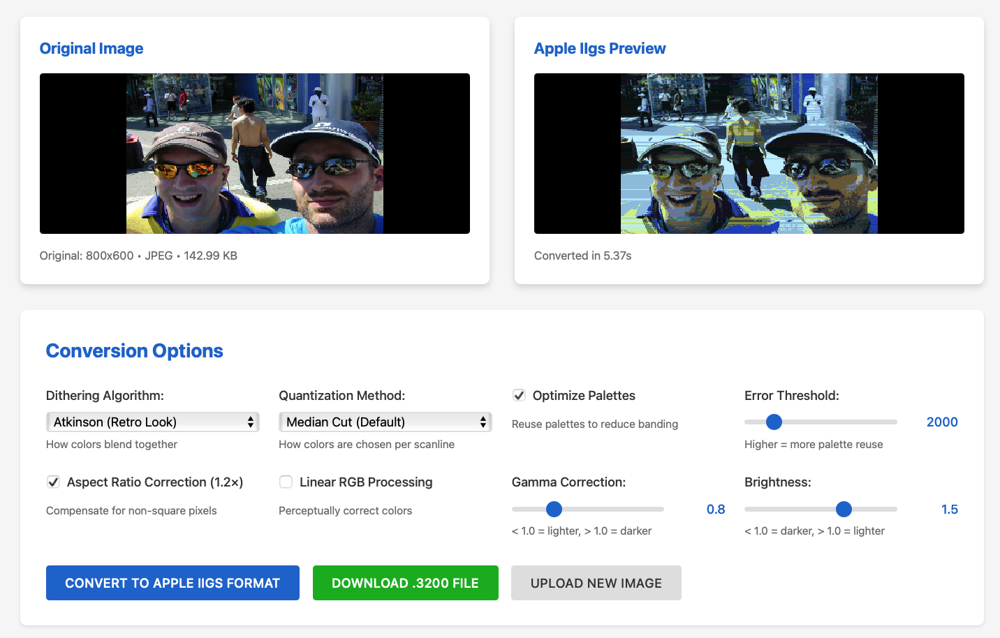

# gs-convert - Apple IIgs Image Converter

Convert modern high-resolution images (PNG, JPEG) to Apple IIgs Super High-Resolution (SHR) format.


*Example: Modern image converted to Apple IIgs 320×200 resolution with 16 colors per scanline*

## Features

- **Multiple Dithering Algorithms**: Atkinson, Floyd-Steinberg, JJN, Stucki, Burkes, Ordered/Bayer, or none
- **Smart Color Quantization**: Per-scanline median cut or global palette optimization
- **Aspect Ratio Correction**: Compensate for Apple IIgs non-square pixels
- **Batch Processing**: Convert multiple images at once
- **Preview Generation**: Generate PNG previews without needing an emulator
- **Format Support**: Outputs .3200 format (32KB unpacked SHR)

## Installation

```bash
# Clone the repository
git clone https://github.com/yourusername/gs_convert.git
cd gs_convert

# Install in development mode
pip install -e .

# Or install from PyPI (when published)
pip install gs-convert
```

## Quick Start

### Command Line Interface

```bash
# Basic conversion (uses Atkinson dithering by default)
gs-convert convert photo.jpg output.3200

# With preview
gs-convert convert photo.jpg output.3200 --preview preview.png

# Use Floyd-Steinberg dithering for photographs
gs-convert convert photo.jpg output.3200 --dither floyd-steinberg

# Pixel art with no dithering
gs-convert convert sprite.png output.3200 --dither none --resize-filter nearest

# Use presets
gs-convert convert photo.jpg output.3200 --preset photo
```

### Web UI (Optional)

A browser-based interface is available for interactive conversion with live preview:

```bash
# 1. Install with UI dependencies
pip install -e ".[ui]"

# 2. Run the web server
python -m gs_convert_ui.app

# 3. Open browser to http://localhost:5000
```

Features drag-and-drop upload, side-by-side preview, all conversion options, and real-time statistics.

See [Web UI Documentation](gs_convert_ui/README.md) for details.

## Dithering Algorithms

- **atkinson** (default): High-contrast, retro aesthetic, perfect for Apple IIgs era
- **floyd-steinberg**: Smooth, good for photographs
- **jjn**: Very smooth, high quality
- **stucki**: Similar to JJN with different weights
- **burkes**: Faster alternative to JJN/Stucki
- **ordered/bayer**: Fast, predictable patterns, retro look
- **none**: No dithering, clean posterized look

## Command Reference

### Convert Single Image

```bash
gs-convert convert INPUT OUTPUT [OPTIONS]

Options:
  -d, --dither [atkinson|floyd-steinberg|jjn|stucki|burkes|ordered|none]
  -q, --quantize [median-cut|global]
  -a, --aspect FLOAT          Aspect ratio correction (default: 1.2)
  -r, --resize-filter [lanczos|bilinear|nearest]
  --linear/--no-linear        Use linear RGB color space
  -p, --preview PATH          Generate PNG preview
  --preset [photo|pixel-art|line-art]
```

### Batch Convert

```bash
gs-convert batch INPUT_FILES... --output-dir DIR [OPTIONS]

Example:
  gs-convert batch *.jpg *.png --output-dir converted/ --preset photo
```

### File Info

```bash
gs-convert info FILE.3200

# Displays palette usage and file information
```

## Presets

- **photo**: Atkinson dithering, per-scanline median cut, Lanczos resize
- **pixel-art**: No dithering, nearest-neighbor resize (preserves hard edges)
- **line-art**: Atkinson dithering, optimized for drawings and comics

## Color Processing

The converter uses perceptually correct linear RGB color space for processing, then converts to Apple IIgs 12-bit color (4096 colors: 4 bits per R, G, B channel).

Each scanline can have its own 16-color palette, allowing the full use of the Apple IIgs's unique per-scanline palette capability.

## Output Format

Generates `.3200` files (32,768 bytes):
- 32,000 bytes: Pixel data (320×200, 4 bits per pixel)
- 256 bytes: SCB (Scan Line Control Bytes)
- 512 bytes: Palette data (16 palettes × 16 colors × 2 bytes)

## Testing on Emulators

Use these emulators to test your converted images:
- **GSPort**: Excellent Apple IIgs emulator (cross-platform)
- **MAME**: Multi-system emulator with Apple IIgs support
- **Sweet16**: macOS-specific emulator

## Development

```bash
# Install with development dependencies
pip install -e ".[dev]"

# Run tests
pytest

# Format code
black src/ tests/

# Type checking
mypy src/
```

## Algorithm Details

See the comprehensive documentation:
- [Apple IIgs Image Conversion Guide](docs/apple_iigs_image_conversion_guide.md)
- [Dithering and Median Cut Guide](docs/dithering_and_median_cut_guide.md)

## Contributing

Contributions welcome! This project is for the retro computing community.

## License

MIT License - see LICENSE file

## Acknowledgments

- Bill Atkinson for the Atkinson dithering algorithm
- The Apple IIgs community for keeping the platform alive
- All contributors to retro computing preservation
